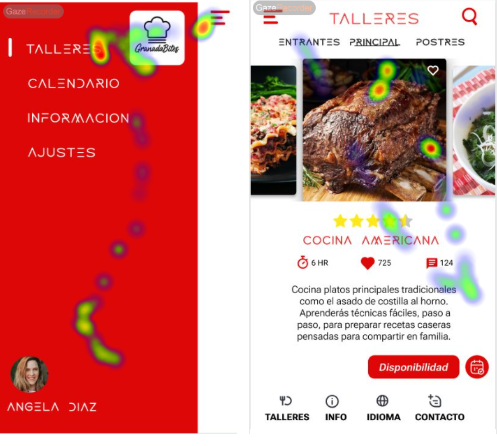
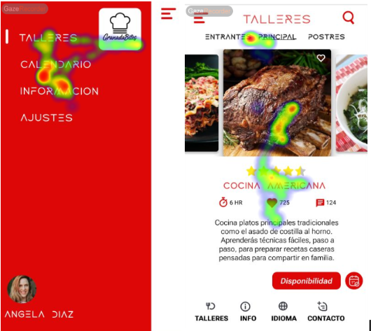

# Usability Report

#### Evaluación de usabilidad del proyecto 

### GRANADA BITES

### 30/5/2025

[[Enlace a GITHUB del proyecto](https://github.com/pabloferugr/UX_CaseStudy)]

### Realizado por: DIU2.com

Nos ha parecido divertido relacionarnos con los demás compañeros para evaluar la práctica y usar nuevas herramientas en el proceso.

## 1 DESCRIPCIÓN DEL WEBSITE

El propósito de Granada Bites, es reservar un taller de comida que hay en un día concreto, además de darnos una información sobre los platos que se van a realizar dicho día, como son los entrantes, el plato principal o el postre.

 

## 2 RESUMEN EJECUTIVO

El documento tiene un inicio, un menú con 4 opciones con una página cada uno, que son calendario, información y talleres. En talleres vemos distintas opciones de talleres, que se pueden reservar. Además de si le das a la imagen tenemos más información detallada, del taller. En calendario nos lleva a lo mismo que disponibilidad y cuando le das al botón de la compra finaliza la compra.

Problemas que hemos detectados:
   - El tipo de letra, de los títulos a veces dificulta la lectura
   - No hay un breadcrumbs de donde venimos
   - Para dar más información de un taller, no es muy intuitivo darle a la imagen.
   - Para finalizar una compra, el botón de la cesta no lo vemos tampoco intuitivo, se le debería de poner poner algo de texto
   - Si vemos ambos eye tracking, podemos ver que nadie se fija en el botón de reservar, que pone disponibilidad, a lo mejor se le debería de cambiar el nombre. A pesar de ello, no costó ver la información del día de hoy.
   - El login está un poco escondido

## 3 METODOLOGIA 

#### Metodología de usabililidad

Hemos usado el método A/B testing, el eye tracking y el SUS para dos usuarios, de la misma edad pero distinto género

 

#### Test de usuarios: Participantes

| USUARIO | 1 | 2 |
| ---------- | -- | -- |
| ¿Reservarias online? | 10 | 10 |
| ¿Te gusta probar comidas nuevas? | 8 | 10 |
| ¿Te gusta realizar actividades nuevas? | 10 | 10 |
| ¿Encuentras la página saturada? | 4 | 1 |
| ¿Reconocerías el logo si lo vieres en otro sitio? | 10 | 6 |
| ¿Encontraste difícil ver la información de hoy? | 1 | 3 |

Como vemos ambos usuarios reservan en internet y les gusta probar comidas nuevas al igual que hacer actividades nuevas, por lo que son válidos para seguir haciendo los test.

Ambos tienen una opinión de que la página no está cargada y que no es difícil encontrar la información de hoy, y estos son aspectos positivos.

#### Resultados obtenidos

  ##### SUS:

| USUARIO | 1 | 2 |
| ------- | -- | -- |
| Creo que me gustará visitar con frecuencia este website | 3 | 2 |
| Encontré el website innecesariamente complejo | 2 | 1 |
| Pensé que era fácil utilizar este website | 4 | 5 |
| Creo que necesitaría del apoyo de un experto para recorrer el website | 1 | 2 |
| Encontré las funciones del website bastante bien integradas | 3 | 4 |
| Pensé que había demasiada inconsistencia en el website | 1 | 1 |
| Imagino que la mayoría de las personas aprenderían muy rápidamente a utilizar el website | 5 | 5 |
| Encontré el website muy grande al recorrerlo | 1 | 2 |
| Me sentí muy confiado en el manejo del website | 2 | 3 |
| Necesito aprender muchas cosas antes de manejarse en el website | 1 | 1 |
| Resultado | 77.5 | 85 |

  ##### Eye Tracking:

  ###### Usuario 1:
  

  ###### Usuario 2:

  

## 4 CONCLUSIONES 

Como hemos visto en el SUS el valor que dan ambos, nos dice que la página es aceptable. Por lo tanto la página es usable por usuarios con conocimientos básicos.

En cuanto al eyetracking vemos que más o menos ambos se fijan en lo mismo, siendo la parte que más mira el menú y no tanto la parte del login y en la otra foto vemos que ven la imagen, leen más o menos el texto, pero no se fijan en el botón “DISPONIBILIDAD” como hemos dicho anteriormente. Esto puede ser un indicativo de que el texto no es representativo, con lo que quiere hacer el botón o simplemente no llama la atención.

#### Incidencias

No hemos encontrado ninguna incidencia

#### Valoración 

* (Puntos Positivos a destacar)

Podemos destacar el diseño moderno que tiene, lo que da mayor seguridad, es decir, que sea fiable, que no se ha quedado sin ningún cuidado y por tanto sigue activa. Y la facilidad de uso exceptuando algunas cosillas.

Además, los colores están bien integrados y que los iconos escogidos son representativos.

#### Recomendaciones y propuesta de mejoras: 

* (Puntos de mejora)

   - Cambiaríamos el tipo de letra de los títulos por uno más completo para mayor legibilidad
   - Cambiaríamos el texto de disponibilidad por reservar.
   - En el botón de compra que es una cesta le añadiremos texto para que sea más claro
   - El login lo pondría en el menú de abajo para que se encuentre mejor.

#### Valoración de la prueba de usabilidad (self-assesment)

Hemos visto adecuados los métodos usados para valorar la práctica, además de que nos han guiado para saber en qué fijarnos. Hemos encontrado un problema en el eyetracking ya que solo permite dos muestras gratuitas y no lo sabiamos, como consecuencia algunos usuarios valorados lo han tenido que volver a repetir (varias veces hasta que nos dimos cuenta de porque no nos lo mostraba).
